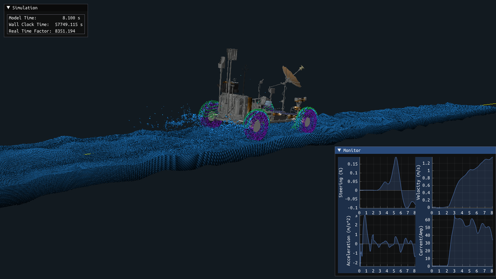

## CLVSim

Crewed lunar vehicle simulation (CLVSim) is a MBD-FEM-SPH co-simulation framework to simulate crewed lunar vehicle in off-road environment based on [Project Chrono](https://projectchrono.org/), including SPH soft terrain, FEM flexible wheel, vehicle suspension, motor, and driver. Each subsystem was modelled can benchmarked by some specific tests. 

A high-fidelity instance of CLVSim was modelled and validated based on [Apollo LRV](https://www.nasa.gov/history/alsj/lrvhand.html) and experimental data from [Apollo operation handbook](https://www.lpi.usra.edu/lunar/documents/NTRS/collection2/NASA_TM_X_66816.pdf) released by NASA. LRV was modelled and textured in this project.

The screenshot of CLVSim with Apollo LRV was shown: 

The rendered simulation by [Blender](https://www.blender.org/) is shown:

https://github.com/yiyezhilan/CLVSim/blob/main/Figures/rugged_terrain.mp4

### Install

1. install [Project Chrono](https://projectchrono.org/), VSG, FSI, MKL modules are required
2. build CLVSim (Copy .dll files from Project Chrono)
3. unzip data.7z and put as build/data

